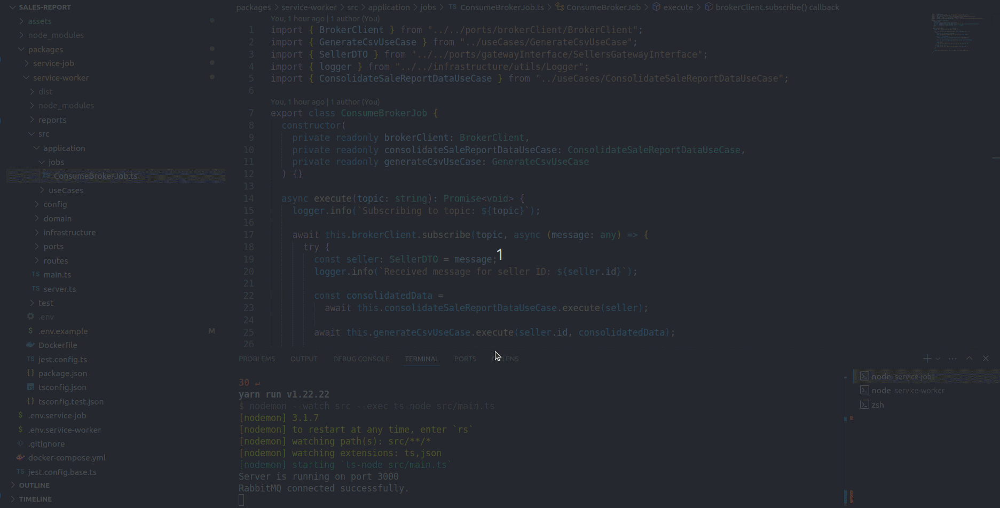
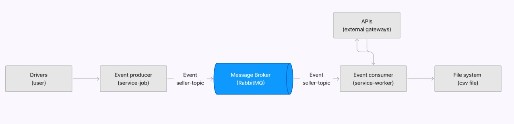
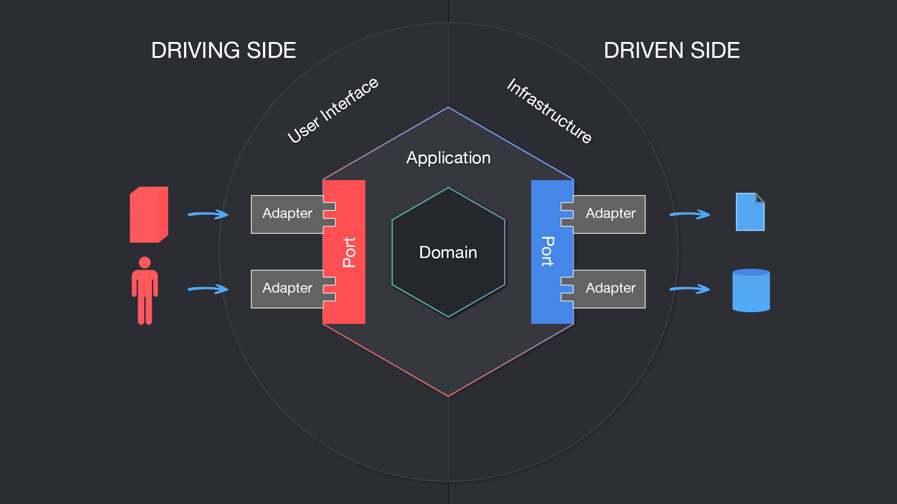

# Sales report EDA based

App based on event driven architecture using services within ports and adapters design

## Preview 👀



## About 🔎

App for get sales report for sellers

### Implemented features :heavy_check_mark:

- [x] Message broker (RabbitMQ)
- [x] Get sales report for sellers
- [x] Save sale report in csv file
- [x] Service Job (ports and adapters architecture based on Nodejs)
- [x] Service Worker (ports and adapters architecture based on Nodejs)
- [x] Docker file and compose for entire application
- [x] Monorepo structure

### Future improvements 🔮

- [ ] Tests
- [ ] Kubernetes Event driven Autoscaling

## Installation

## Requirements

- Node.js >= 18.x

```bash
$ nvm use
```

- yarn

```bash
$ npm install --global yarn
```

## Running the app by docker-compose

### Build resources

```bash
$ docker compose up --build
```

## Running the app locally

### Add env variables

```bash
$ cd packages/service-worker && cp .env.example .env
```

```bash
$ cd packages/service-job && cp .env.example .env
```

### build and run service-job

```bash
$ cd packages/service-job && yarn build && yarn dev
```

### build and run service-worker

```bash
$ cd packages/service-worker && yarn build && yarn dev
```

## App architecture



## Services design


